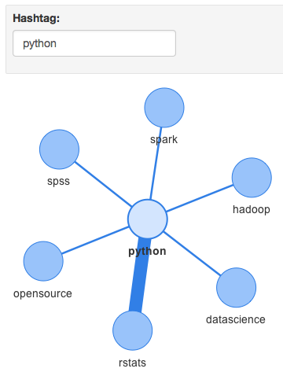

## Agenda

* `RNeo4j`
* `igraph`
* `d3Network`
* `visNetwork`
* `Shiny`

## RNeo4j
```{r, message=FALSE}
library(RNeo4j)

graph = startGraph("http://localhost:7474/db/data/")
summary(graph)
```

## RNeo4j

Retrieve Cypher query results into a data.frame with `cypher`.

```{r}
query = "
MATCH (:Tweet)-[:MENTIONS]->(u:User)
RETURN u.username, COUNT(*) AS mentions
ORDER BY mentions DESC
LIMIT 5
"

cypher(graph, query)
```

## igraph

```{r, message=FALSE}
library(igraph)
```

## igraph

Extract an edgelist with a Cypher query.

```{r}
query = "
MATCH (h1:Hashtag)-[:TAGS]->(:Tweet)<-[:TAGS]-(h2:Hashtag)
WHERE h1.name <> 'rstats' AND h2.name <> 'rstats'
RETURN h1.name, h2.name, COUNT(*) AS weight
"

edges = cypher(graph, query)
head(edges)
```

## igraph

Read the edgelist into igraph with `graph_from_data_frame` and plot with `plot`.

```{r}
ig = graph_from_data_frame(edges, directed=F)
plot(ig)
```

## igraph

Let's set some options.

```{r}
plot(ig, vertex.color="cyan", vertex.label=NA)
```

## igraph

Let's make the size of the nodes a function of some graph metric, e.g. betweenness.

```{r}
sort(betweenness(ig), decreasing = T)[1:5]
```

## igraph
```{r}
plot(ig, vertex.color="cyan", vertex.label=NA,
     vertex.size=betweenness(ig) / (max(betweenness(ig) * .1)))
```

## igraph

`igraph` has several community-detection algorithms.

```{r}
clusters = cluster_edge_betweenness(ig)
clusters[1:3]
```

## igraph

We can incorporate these into visualizations easily.

```{r}
plot(ig, vertex.color=clusters$membership, vertex.label=NA)
```

## d3Network

```{r}
library(d3Network)
```

## d3Network

We can use the same edgelist with `d3SimpleNetwork`.

```{r, results="asis"}
d3SimpleNetwork(edges, iframe=T)
```

## d3Network

`d3ForceNetwork` requires both a nodes data.frame and an edges data.frame. We already have the edges data.frame, and we can extract a nodes data.frame out of the edgelist.

```{r}
nodes = data.frame(name=unique(c(edges$h1.name, edges$h2.name)))

head(nodes)
```

## d3Network

We also need an edges data.frame that refers to the indexed position of the node in the nodes data.frame.

```{r}
for(i in 1:nrow(edges)) {
  from = edges$h1.name[i]
  to = edges$h2.name[i]
  
  edges$source[i] = which(nodes$name == from)
  edges$target[i] = which(nodes$name == to)
}
```

## d3Network

Despite indexes starting at 1 in R, `d3ForceNetwork` expects indexing to start at 0.

```{r}
edges$source = edges$source - 1
edges$target = edges$target - 1

head(edges)
```

## d3Network

We're finally ready to plot!

```{r, results="asis"}
d3ForceNetwork(edges, nodes, Source="source", Target="target",
               iframe=T, zoom=T)
```

## d3Network

Let's add the cluster membership that was determined earlier in `igraph`.

```{r}
nodes$group = clusters$membership

head(nodes)
```

## d3Network
```{r, results="asis"}
d3ForceNetwork(edges, nodes, Source="source", Target="target",
               Group="group", NodeID="name", iframe=T, zoom=T)
```

## visNetwork

```{r, message=FALSE}
library(visNetwork)
```

## visNetwork

For the sake of variety, let's get a different edgelist out of Neo4j. Let's say we're interested in users mentioning other users.

```{r}
query = "
MATCH (u1:User)-[:POSTS]->(:Tweet)-[:MENTIONS]->(u2:User)
RETURN u1.username AS from, u2.username AS to, COUNT(*) AS weight
"

edges = cypher(graph, query)

head(edges)
```

## visNetwork

`visNetwork` requires a nodes data.frame separate from the edges data.frame.

```{r}
nodes = data.frame(id=unique(c(edges$from, edges$to)))

head(nodes)
```

## visNetwork

We need a `label` column in the nodes data.frame for the node labels in the visualization.

```{r}
nodes$label = nodes$id

head(nodes)
```

## visNetwork
```{r}
visNetwork(nodes, edges)
```

## visNetwork

Let's use `igraph` to gather some insights and supplement the visualization. 

```{r}
ig = graph_from_data_frame(edges, directed=T)
```

## visNetwork

Again, we'll use `cluster_edge_betweenness` to determine communities.

```{r}
clusters = cluster_edge_betweenness(ig)

length(clusters)
```

## visNetwork

To color nodes by their cluster assignment, we'll use the `group` column that `visNetwork` expects.

```{r}
nodes$group = clusters$membership

head(nodes)
```

## visNetwork

```{r}
visNetwork(nodes, edges)
```

## visNetwork

Let's make the node sizes a function of their betweenness.

```{r}
nodes$value = betweenness(ig)

head(nodes)
```

## visNetwork

We can always determine who has the highest betweenness by sorting...

```{r}
sort(betweenness(ig), decreasing=T)[1:5]
```

## visNetwork

But it's more fun and insightful to determine them visually, as a visualization provides context.

```{r}
visNetwork(nodes, edges)
```

## Shiny

Let's build an interactive tool for visualizing hashtags.

```{r}
query = "
MATCH (h1:Hashtag)-[:TAGS]->(:Tweet)<-[:TAGS]-(h2:Hashtag)
WHERE h1.name = {hashtag}
RETURN h1.name AS from, h2.name AS to, COUNT(*) AS value
"
```

## Shiny

```{r, eval=FALSE}
inputPanel(
  textInput("hashtag", label="Hashtag:", value="python")
)

renderVisNetwork({
  edges = cypher(graph, query, hashtag=input$hashtag)
  nodes = data.frame(id=unique(c(edges$from, edges$to)))
  nodes$label = nodes$id
  visNetwork(nodes, edges)
})
```

## Shiny



## RNeo4j

### More Resources

* `github.com/nicolewhite/RNeo4j`
* `nicolewhite.github.io`
* `markneedham.com/blog/r`